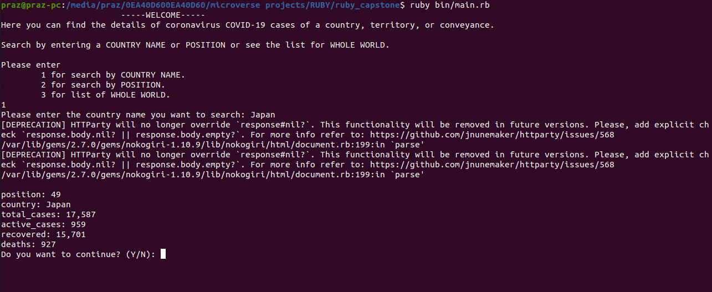

# Ruby Capstone


<!--
*** Thanks for checking out this README Template. If you have a suggestion that would
*** make this better, please fork the repo and create a pull request or simply open
*** an issue with the tag "enhancement".
*** Thanks again! Now go create something AMAZING! :D
-->

<!-- PROJECT SHIELDS -->
<!--
*** I'm using markdown "reference style" links for readability.
*** Reference links are enclosed in brackets [ ] instead of parentheses ( ).
*** See the bottom of this document for the declaration of the reference variables
*** for contributors-url, forks-url, etc. This is an optional, concise syntax you may use.
*** https://www.markdownguide.org/basic-syntax/#reference-style-links
-->
[![Contributors][contributors-shield]][contributors-url]
[![Forks][forks-shield]][forks-url]
[![Stargazers][stars-shield]][stars-url]
[![Issues][issues-shield]][issues-url]

<!-- PROJECT LOGO -->
<br />
<p align="center">
  <a href="https://github.com/praz99/ruby_capstone">
  </a>

  <br />
  <a href="https://github.com/praz99/ruby_capstone"><strong>Explore the docs »</strong></a>
  <br />
  <br />
  <a href="https://github.com/praz99/ruby_capstone/issues">Report Bug</a>
  ·
  <a href="https://github.com/praz99/ruby_capstone/issues">Request Feature</a>
</p>

<!-- TABLE OF CONTENTS -->
## Table of Contents

- [Table of Contents](#table-of-contents)
- [About The Project](#about-the-project)
- [Quick Start](#quick-start)
- [Installation](#installation)
- [Testing](#testing)
- [Built With](#built-with)
- [Contributing](#contributing)
- [Author](#author)
- [Acknowledgements](#acknowledgements)
- [📝 License](#license)

<!-- ABOUT THE PROJECT -->
## About The Project

This is the capstone project for the Ruby section of [Microverse](https://www.microverse.org/)  main curriculum. This project scrapes the data about COVID-19 from [worldometer](https://www.worldometers.info/coronavirus/#countries) website.
<!-- ABOUT THE PROJECT -->

## How program runs
* Welcome message
* The program gives a choice to the user to search by COUNTRY NAME (enter '1') or by POSITION (enter '2') or see data about ALL COUNTRIES (enter '3')
* If the user chooses by POSITION, he/she should type number from 1 to 215, after that user will see the details about the COVID-19 status of the country in that position.
* If the user chooses by COUNTRY NAME, he/she should enter the name of a country, after user will see the details about the COVID-19 status of that country.
* If the user wants to see the data for all countries, he/she do so by entering '3' when prompted.
* After that, the user can choose to continue searching ('Y') or to stop the program ('N')

## Quick Start

#### Get a local copy with:<br>
```js
git clone https://github.com/praz99/ruby_capstone/tree/feature
```
Or just hit (Download Zip) on green button (Clone or Download) on top of this page.

### Installation

* Ruby Language - Version 2.5.5. or higher - [Install guide](https://www.ruby-lang.org/en/documentation/installation/)


Install required gems by navigating to the project directory and enter command
```js
bundle install
```

<!-- * Nokogiri gem - Version 1.10.9. or higher - [Install guide](https://nokogiri.org/tutorials/installing_nokogiri.html)

* HTTParty gem - Version 0.13.7. or higher - [Install guide](https://rubygems.org/gems/httparty/versions/0.13.7) -->


#### Run on terminal/prompt:

If you are on windows:
* Go inside the project folder
* Right shift '+' right mouse click (Float menu)
* Open prompt here (Option)
```js
ruby bin/main.rb
```
For linux:
```js
bin/main.rb
```
### Testing

To test the project

- Navigate to the directory where the project is located.
- Open terminal in this directory.
- Install RSpec by using `gem install rspec` command.
- Start testing by using `rspec` command.

### Built With
This project was built using these technologies.

- Ruby
- Rubocop (Linter) with Github Workflows
- Git (with Gitflow), Github and VScode
- RSPEC

## Contributing
Contributions, issues and feature requests are welcome! Start by:
* Fork the project.
* Clone the project to your local machine.
* `cd` into the project directory.
* Run `git checkout -b your-branch-name`.
* Make your contributions.
* Push your branch up to your forked repository.
* Open a Pull Request with a detailed description to the development branch of the original project for a review.
<!-- CONTACT -->
## Author

👤 **Prajwal Thapa** 
    
- LinkedIn: [Prazwalthapa](www.linkedin.com/in/prazwal-thapa/) 
- GitHub: [@praz99](https://github.com/praz99)
- E-mail: t.prazwal@gmail.com

## Show your support

Give a ⭐️ if you like this project!

<!-- ACKNOWLEDGEMENTS -->
## Acknowledgements
* All data about corona virus COVID-19 belongs to [worldometer.](https://www.worldometers.info/coronavirus/#countries)
* [Microverse](https://www.microverse.org/)

<!-- MARKDOWN LINKS & IMAGES -->
<!-- https://www.markdownguide.org/basic-syntax/#reference-style-links -->
[contributors-shield]: https://img.shields.io/github/contributors/praz99/ruby_capstone.svg?style=flat-square
[contributors-url]: https://github.com/praz99/ruby_capstone/graphs/contributors
[forks-shield]: https://img.shields.io/github/forks/praz99/ruby_tic_tac_toe.svg?style=flat-square
[forks-url]: https://github.com/praz99/ruby_capstone/network/members
[stars-shield]: https://img.shields.io/github/stars/praz99/ruby_tic_tac_toe.svg?style=flat-square
[stars-url]: https://github.com/praz99/ruby_capstone/stargazers
[issues-shield]: https://img.shields.io/github/issues/praz99/ruby_tic_tac_toe.svg?style=flat-square
[issues-url]: https://github.com/praz99/ruby_capstone/issues

## License
- This project is MIT licensed.